# Two-tier architecture
A two-tier architecture is a software architecture in which a presentation layer or interface runs on a client, and a data layer or data structure gets stored on a server. Each tier has specific responsibilities and interacts with each other to provide functionality to end-users.

## Local setup

We are going to use VsCode as an editor. Download it from here [VsCode](https://code.visualstudio.com/) 

We are going to install Terraform extension in VsCode. Download it from here [Terraform](https://developer.hashicorp.com/terraform/downloads) Make sure to restart your system after installation.

You need to install aws-cli to use the aws functionally from your terminal. Download it from here [Cli](https://docs.aws.amazon.com/cli/latest/userguide/getting-started-install.html)

### Create S3 Backend Bucket
Create an S3 bucket to store the .tfstate file in the remote backend.
- It is highly recommended that you enable Bucket Versioning on the S3 bucket to allow for state recovery in the case of accidental deletions and human error.

### Create a Dynamo DB table for state file locking
Give the table a name.
- Make sure to add a Partition key with the name LockID and type as String

### Generate a public-private key pair for our instances
We need a public key and a private key for our server so please follow the procedure I've included below.

cd modules/key/
ssh-keygen

### Create ACM certificate
Go to AWS console -> AWS Certificate Manager (ACM) and make sure you have a valid certificate in Issued status. if not, feel free to create one and use the domain name on which you are planning to host your application.

### Create Route 53 Hosted Zone
Go to AWS Console -> Route53 -> Hosted Zones and ensure you have a public hosted zone available, if not create one with the name of your domain (My domain is hosted on NameCheap).

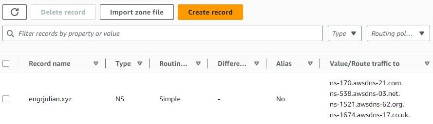

### Domain hosting on NameCheap
Go to the public hosted zone we just created and copy the 4 name servers above to be used as custom DNS servers for our domain hosted on NameCheap.

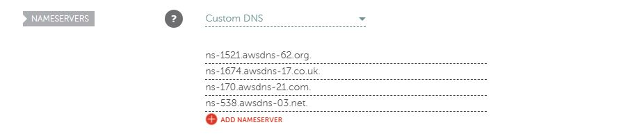

### Create IAM Secret Key
Cretae an IAM user and attach a policy e.g AdministratorAccess.
- Create an Access key and secret key for the IAM user

### Configure AWS-CLI
Open the terminal on your system and type aws configure. it will ask for your Acess key ID and secret key id. Please enter what we have just created. Use the default region us-east-1 

## Write Terraform files
Finally, it's time to write your infrastructure.

### Now we are ready to deploy our infrastructure on the cloud

Get into the project directory
- **cd main**

👉 Let install dependency to deploy the application
- **terraform init** 

Type the below command to see the plan of the execution
- **terraform plan**

✨Finally, HIT the below command to deploy the application...
- **terraform apply -auto-approve**

## Outputs
let's see what Terraform created on our AWS console.

### VPC
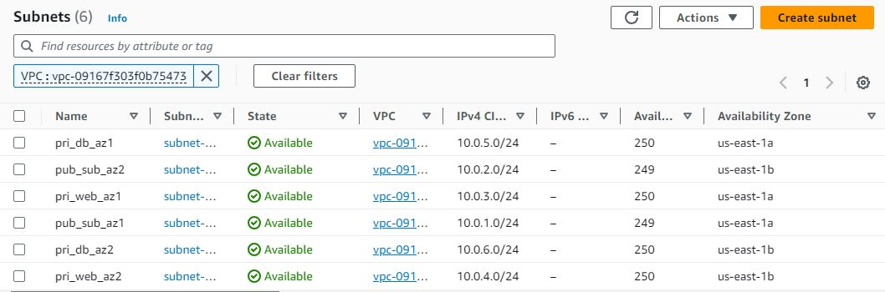

### Security groups
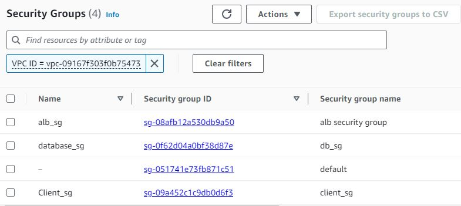

### NAT gateway
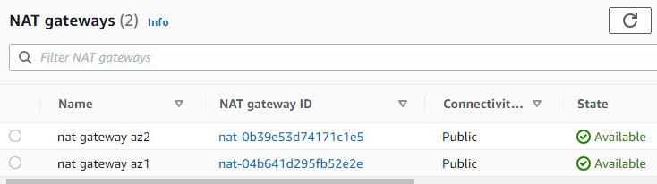

### Internet gateway
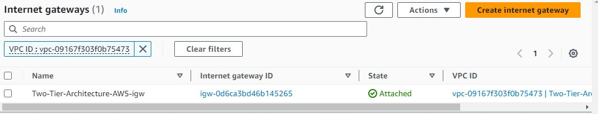

### Routing table
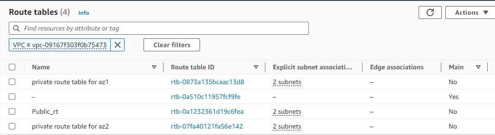

### Launch template
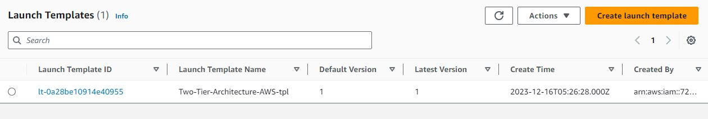

### Target group
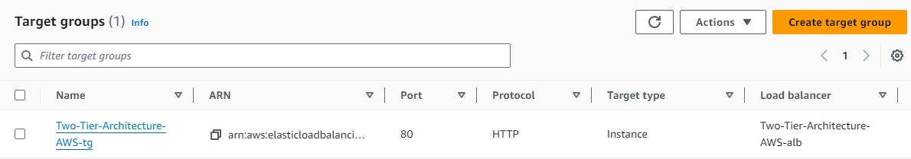

### Application Load balancer
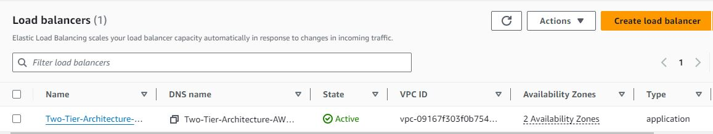

### Auto Scaling group
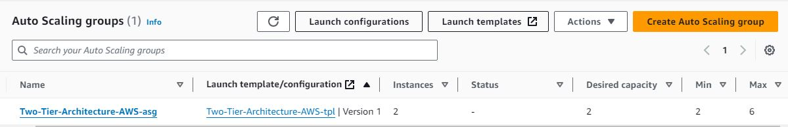

### RDS Instance
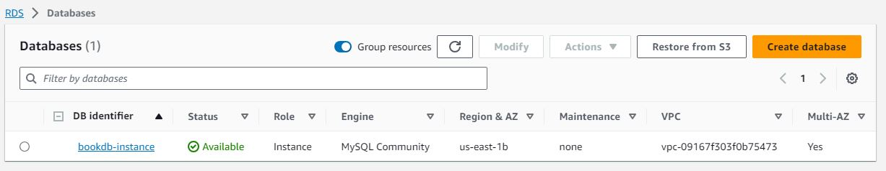

### Cloud Front distribution
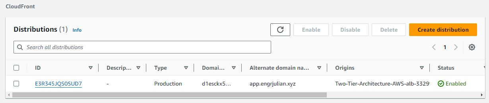

### Record in route 53
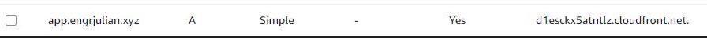

## Our application is successfully deployed
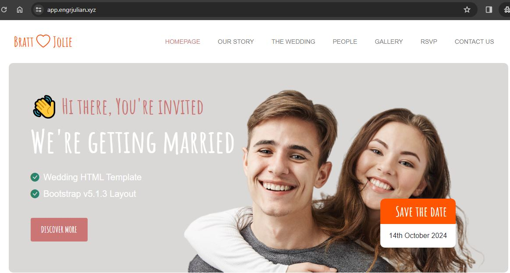